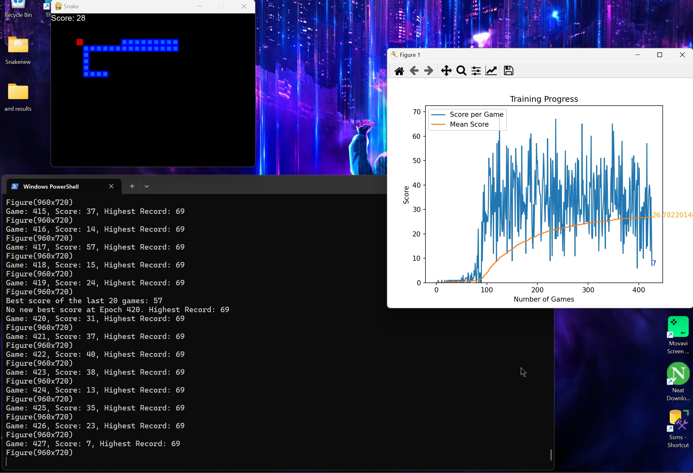

# 🐍 RL Snake Agent
### Deep Q-Network (DQN) Agent trained to play Snake — from scratch to dynamic obstacle mastery


---

## Overview

A Reinforcement Learning agent trained to play the classic Snake game using **Deep Q-Networks (DQN)**. The project follows a full iterative experimentation arc — from a baseline 2-hour training run all the way to an agent that navigates **dynamically respawning obstacles**, achieving a best score of **53**.

The 6-experiment progression tells a complete RL story: baseline → model persistence → fixed obstacles → dynamic curriculum.

---

## Results

| Experiment | Description | Best Score |
|---|---|---|
| 1 — Baseline | Basic DQN, 2-hr train, no model save | — |
| 2 — Model Save | Added checkpoint saving + load_test script | ~30 |
| 3 — Fixed Obstacles v1 | Static obstacles added to environment | — |
| 4 — Fixed Obstacles v2 | Refined obstacle placement logic | — |
| 5 — Dynamic (on death) | Obstacles respawn every game over | — |
| **6 — Dynamic (on reward)** ⭐ | **Obstacles respawn every food eaten** | **53** |



---

## Architecture

```
┌─────────────────────────────────────────┐
│              STATE (11 inputs)           │
│  Danger: straight / right / left         │
│  Direction: L / R / U / D               │
│  Food: left / right / up / down         │
└──────────────────┬──────────────────────┘
                   │
                   ▼
┌─────────────────────────────────────────┐
│         Linear_QNet  (PyTorch)          │
│   Linear(11 → 256) → ReLU              │
│   Linear(256 → 3)                       │
└──────────────────┬──────────────────────┘
                   │
                   ▼
┌─────────────────────────────────────────┐
│         ACTION (3 outputs)              │
│   [1,0,0] Straight                      │
│   [0,1,0] Turn Right                    │
│   [0,0,1] Turn Left                     │
└─────────────────────────────────────────┘
```

**Training loop:**
- **Short-memory training** — single step after each action
- **Long-memory training** — random batch replay from experience buffer (`deque`, max 100k)
- **ε-greedy exploration** — `ε = 80 - n_games`, decays over time
- **Bellman equation** — `Q_new = reward + γ × max(Q(next_state))`
- **Model checkpointing** — saves best model every 20 epochs if a new record is set

---

## Project Structure

```
rl-snake-agent/
├── agent.py                  # DQN agent — state extraction, memory, training loop
├── model.py                  # Linear_QNet + QTrainer (Bellman, Adam, MSELoss)
├── snake_gameai.py           # Pygame environment — game logic, obstacles, rewards
├── Helper.py                 # Live matplotlib training curve
├── load_test_updated.py      # Load saved model and run inference
├── arial.ttf                 # Font for Pygame display
├── requirements.txt
├── saved_models/
│   └── best_model_epoch_120_score_53.h5   # Best trained weights
├── results/
│   ├── training_curve_exp2.png            # Training progress screenshot
│   └── training_demo_exp2.png
└── experiments/              # All 6 training iterations (source code per run)
    ├── 1-baseline-2hr-train/
    ├── 2-normal-with-model-save/
    ├── 3-fixed-obstacles-v1/
    ├── 4-fixed-obstacles-v2/
    ├── 5-dynamic-obstacles-on-death/
    └── 6-dynamic-obstacles-on-reward/     # Final version (same as root)
```

---

## Quick Start

### 1 — Install dependencies

```bash
git clone https://github.com/YOUR_USERNAME/rl-snake-agent.git
cd rl-snake-agent
pip install -r requirements.txt
```

### 2 — Train from scratch

```bash
python agent.py
```

A live training curve will appear. Training stops automatically after **1,000 games**. Best models are saved to `saved_models/` every 20 epochs when a new record is set.

### 3 — Watch the trained agent play

```bash
python load_test_updated.py
```

> **Note:** The default model loaded is `saved_models/best_model_epoch_120_score_53.h5`. If you trained a new model, update the filename in `load_test_updated.py` line 7 to match your saved checkpoint.

---

## How It Works

### State Space (11 inputs)

The agent observes the game as an 11-dimensional boolean vector:

```python
state = [
    danger_straight, danger_right, danger_left,   # 3 — collision ahead
    dir_left, dir_right, dir_up, dir_down,         # 4 — current direction
    food_left, food_right, food_up, food_down       # 4 — food position
]
```

### Reward Structure

| Event | Reward |
|---|---|
| Eat food | `+10` |
| Die (wall / self / obstacle) | `-10` |
| Survive | `0` |

### Dynamic Obstacles (Final Version)

In experiment 6, **3–5 obstacles respawn in random positions every time the snake eats food**. This forces the agent to continuously re-adapt its path rather than memorizing a fixed map — a form of curriculum-free environment randomization.

---

## Tech Stack

| Component | Technology |
|---|---|
| RL Algorithm | Deep Q-Network (DQN) |
| Neural Network | PyTorch — `Linear_QNet` (11→256→3) |
| Optimizer | Adam (lr=0.001) + MSELoss |
| Game Engine | Pygame |
| Visualization | Matplotlib (live training curve) |
| Experience Replay | `collections.deque` (max 100k transitions) |

---

*Built with Python 3.10 · PyTorch · Pygame*
